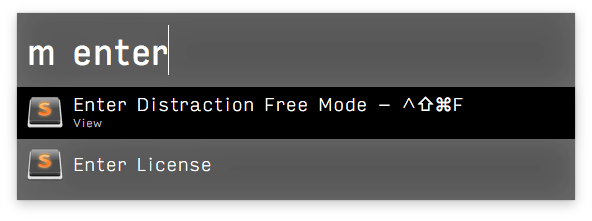

# Menu-Bar-Search

Search through menu options for front-most application - an Alfred Workflow

> This is a ~~slightly~~ _much_ faster implementation of [ctwise's Menu Bar Search](https://www.alfredforum.com/topic/1993-menu-search/).

[Download](https://github.com/BenziAhamed/Menu-Bar-Search/raw/master/Menu%20Bar%20Search.alfredworkflow)

## Features

- Fast fuzzy menu name search and selection
- Integrates with Alfred's learning abilities to display commonly used menu items first

## Change log

- 1.0 - Initial Release
- 1.1 - Added Fuzzy Text Matching for Menus

  If you have a menu item `New Tab`, then typing `m nt` in Alfred will match `New Tab`, since `n` and `t` matches the first letters of the menu text.

- 1.1.1 - Changed run behaviour to terminate previous script, this makes the experience slightly more faster
- 1.2 - Completely native menu clicking, removed reliance on AppleScript
  - 1.2.1 - Performance improvements when generating menus using direct JSON encoding
  - 1.2.2 - More performance improvements while filtering menu items
- 1.3 - Added `-async` flag to allow threaded scanning and populating of menus
- 1.4 - Added `-cache` setting to enable menu result caching and also set a timeout for cache invalidation
  - 1.4.1 - Invalidate cache (if present) after actioning a menu press
  - 1.4.2 - Slide the cache invalidation window forward in case we get invalidated by a near miss
  - 1.4.3 - Speed improvements to caching, text search and fuzzy matching
  - 1.4.4 - Added `-no-apple-menu` flag that will skip the apple menu items
  - 1.4.5 - Tuned fuzzy matcher, allows non-continuous anchor token search
- 1.5 - Faster caching using protocol buffers
  - 1.5.1 - Reduced file creation for cache storage
  - 1.5.2 - Better support for command line apps that create menu bar owning applications
  - 1.5.2 - Better support for command line apps that create menu bar owning applications
