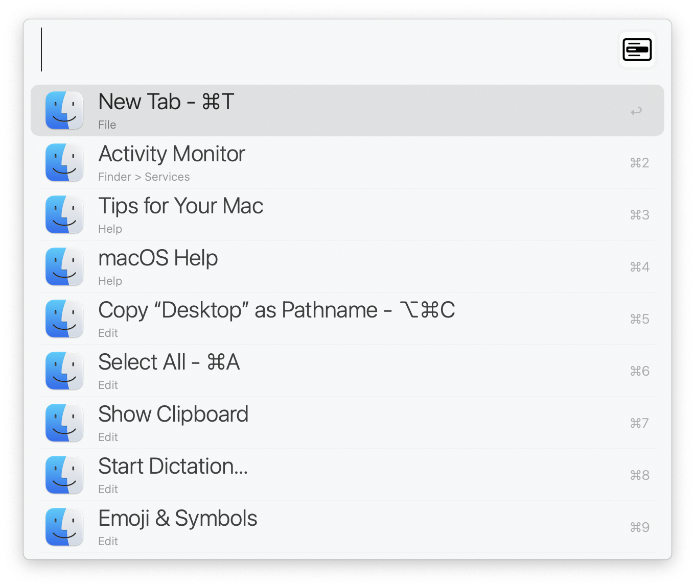
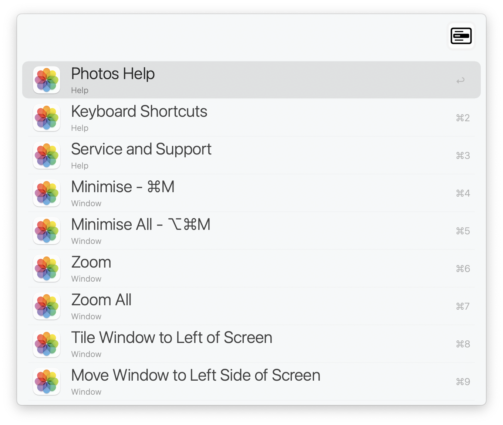
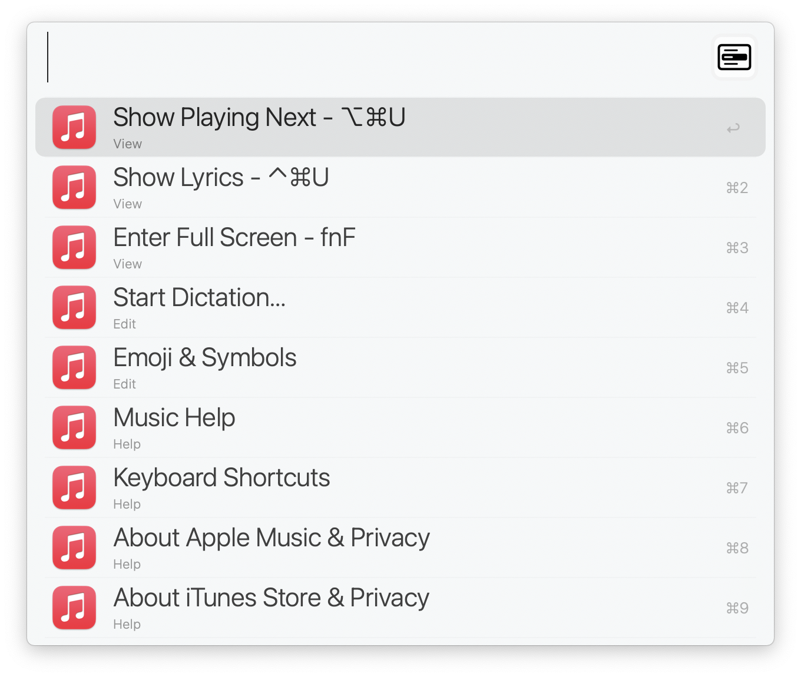

#  Menu Bar Search - An Alfred Workflow

Quickly search through menu options of the front-most application. [↓ Download](https://github.com/BenziAhamed/Menu-Bar-Search/releases/latest/download/Menu.Bar.Search.alfredworkflow)

   
   
  
  

### Running on macOS Catalina and beyond (v1.8+)
If you face issues from Catalina or beyond, in relation to not being able to run the workflow due to security issues (e.g. malicious software checks), have a look at https://github.com/BenziAhamed/Menu-Bar-Search/issues/4 for possible workarounds.

> I am working to fix and resolve this.

## Usage

- Type `m` in Alfred to list menu bar items for front most application.
- You can filter menu items by name, or do a fuzzy search.
- Alternatively, set a hotkey to trigger the workflow as well.

E.g

- `m new tab` will match the menu item **New Tab**
- `m cw` will match the menu item **Close Window**

## Change log

- 1.0 - Initial Release
- 1.1 - Added Fuzzy Text Matching for Menus
- 1.1.1 - Changed run behaviour to terminate previous script, this makes the experience slightly more faster
- 1.2 - Completely native menu clicking, removed reliance on AppleScript
  - 1.2.1 - Performance improvements when generating menus using direct JSON encoding
  - 1.2.2 - More performance improvements while filtering menu items
- 1.3 - Added `-async` flag to allow threaded scanning and populating of menus
- 1.4 - Added `-cache` setting to enable menu result caching and also set a timeout for cache invalidation
  - 1.4.1 - Invalidate cache (if present) after actioning a menu press
  - 1.4.2 - Slide the cache invalidation window forward in case we get invalidated by a near miss
  - 1.4.3 - Speed improvements to caching, text search and fuzzy matching
  - 1.4.4 - Added `-no-apple-menu` flag that will skip the apple menu items
  - 1.4.5 - Tuned fuzzy matcher, allows non-continuous anchor token search
- 1.5 - Faster caching using protocol buffers
  - 1.5.1 - Reduced file creation for cache storage
  - 1.5.2 - Better support for command line apps that create menu bar owning applications
  - 1.5.3 - Protocol buffer everything - microscopic speed improvements, but hey...
  - 1.5.4 - Added various environment variables to fine tune menu listings
  - 1.5.5 - Tweaked ranking of search results for better menu listings
- 1.6 - Added per app customization via Settings.txt configuration file
- 1.7 - Universal build for M1 and Intel
- 1.8 - Fixed the universal build
- 1.9 - changed to user configuration, and signed executable (exported using Alfred 5)

## Credits

- Based on the ctwise's ObjC implementation of [Menu Bar Search](https://www.alfredforum.com/topic/1993-menu-search/), which I've ported over to Swift and added caching and per app configuration to speed things up.
